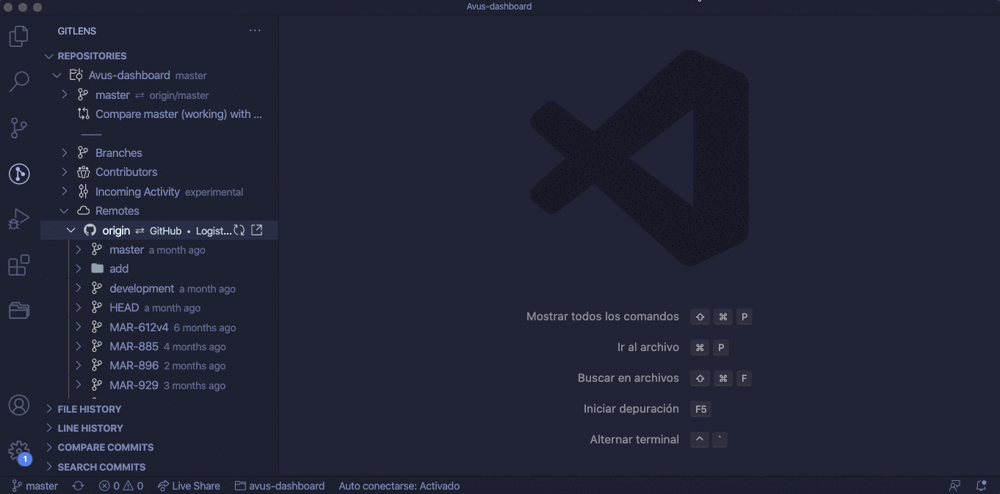



# Repository Readme

The README of the repository should have the following information:

## Description

A description of what the project does.

## Installation guide

Here it should give instructions on setting up the project locally, listing all the prerequisites (node version, pm2, nodemon, etc.)

## Possible commands

- Command to run the project, e.g., `npm start`
- Command to run the tests, e.g., `npm test`

## Deploying

Summary of how to deploy new changes. Specify if the changes are deployed using continuous integration or if they need to be deployed manually, if so, how to do it.

## Contributing

The process for submitting a pull request

## Directory structure

If the project follows some structure, explain it.

## Readme example

````markdown
# Check In Worker.

A worker that runs every day to calculate distances, generate check-in records and send SMS to couriers to remember them to check in.

## Getting Started

### Prerequisites

- Node ^12.4.0
- PM2

### Installing

Clone the repository

```bash
git clone git@github.com:Farmacia-Logistica/repository.git && cd repository
```


Install dependencies

```bash
# Using npm
npm install
# Using yarn
yarn install
```

Add environment variables

```bash
cp .env.example .env
```

## Running the project

For running the project using PM2. Remember that this will only start the cron and probably you won't see anything.

```bash
npm run pm2
```

## Running the tests

The App uses [Jest](https://github.com/facebook/jest) for testing.
To execute the test run:

```bash
# Using npm
npm test
# Using yarn
yarn test
```

## Deploy changes

To deploy the changes run (from your computer):

### Deploy to production

```bash
ssh new-workers "prod/check-in-worker/deploy.prod.sh"
```

## Directory structure

```
.vscode/
├─ launch.json
src/
├─┬─ db/
│ ├─ models/
│ ├─ utils/
│ └─ config.js
├─ .env.example
├─ .eslintrc.js
├─ .prettierrc.json
├─ deploy.sh
└─ ecosystem.config.js
```

### .vscode/launch.json

Debug configuration for VScode. There are two configurations, one for debugging `calculationWorker.js` and another for `reportWorker.js`. To run the debugger press **F5**

### src/

All main code goes here.

### src/db

Database configuration (using Knex)

## Contributing

1. Create your Feature Branch (git checkout -b feature/AmazingFeature)
2. Commit your changes (git commit -m 'Add some AmazingFeature')
3. Push to the Branch (git push origin feature/AmazingFeature)
4. Open a Pull Request

````

# Code Style

Every project has its own style guide: a set of conventions about how to write code for that project. “Style” covers a lot of ground, from “use camelCase for variable names” to “never use global variables” to “never use exceptions.”. Set all these rules are up to the author(s) of the project, here will only list some examples and ways to follow these rules.

## ESLint | Prettier

These tools are useful to keep a consistent syntax all around the project. **[eslint](https://eslint.org/)** set some rules that help to prevent some syntax errors, while **[prettier](https://prettier.io/)** is useful for defining a code style so these tools can be used together.

The rules are defined in configuration files. for eslint, you need to create a `.eslintrc.js` file in the root directory. For prettier, a `.prettierrc.json` is needed to set code style rules.

### Prettier

This is an example of a configuration file.

```json
{
  "arrowParens": "always", // Include parentheses around a sole arrow function parameter.
  "printWidth": 80, // Specify the line length that the printer will wrap on.
  "semi": true, // Print semicolons at the ends of statements.
  "singleQuote": false, // Use single quotes instead of double quotes.
  "tabWidth": 2, // Specify the number of spaces per indentation-level.
  "trailingComma": "es5", // Print trailing commas wherever possible when multi-line.
}
````

This prettier configuration will generate something like this.

**Original code:**

```javascript
function helloWorld() {
  console.log("hello world!");
  const add = (a, b) => a + b;
  const log = msg => console.log(msg);
  return {
    message: "Hello world!",
    add: add,
    log: log
  };
}
```

**Result:**

```javascript
function helloWorld() {
  // The tab size change from 4 to 2.
  console.log("hello world!"); // <- change single quotes for double quotes
  const add = (a, b) => a + b; // <- add semicolon at the end.
  const log = msg => console.log(msg); // <- it will add a parentheses to an arrow function when it has only one parameter
  return {
    message: "Hello world!",
    add: add,
    log: log // <- add trailing comma.
  };
}
```

You can find a link to all the available options in the **[resources section](##Resources)**

### ESLint

```javascript
module.exports = {
  env: {
    commonjs: true,
    es2020: true,
    node: true,
    jest: true, // add support for jest
  },
  extends: ["eslint:recommended", "prettier"], // use eslint and prietter together
  parserOptions: {
    ecmaVersion: 11,
  },
  rules: { // set custom rules
    no-unused-vars: "error", // it will show a warn every time it found a not used variable
    no-undef: "error" // it will show a warn when a undefined variable is used
  },
};
```

**Code:**

```javascript
var foo = bar;
```

This will throw these errors:

- 1:5 - 'foo' is assigned a value but never used. (no-unused-vars)
- 1:11 - 'bar' is not defined. (not-undef)

## Pre-commit Hook

You can use Prettier and ESLint with a pre-commit tool. This can re-format and analyze your files that are marked as “staged” via git add before you commit.

### lint-staged

Run linters against staged git files.

```bash
npx mrm lint-staged
```

It will install and configure husky and lint-staged depending on code quality tools from **package.json**

```json
// Package.json
{
  //...
  "husky": {
    "hooks": {
      "pre-commit": "lint-staged",
      "pre-push": "CI=true npm run test"
    }
  },
  "lint-staged": {
    "*.js": "eslint --cache --fix",
    "*.{js,css,md}": "prettier --write"
  }
  //...
}
```

Every time you commit files, **eslint** and **prettier** are executed to find syntax error and format the files. And, when you push code, the test suit runs, if a test fails, the changes won't be committed.

## Resources

- [Prettier vs. Linters · Prettier](https://prettier.io/docs/en/comparison.html)
- [Options · Prettier](https://prettier.io/docs/en/options.html)
- [lint-staged](https://github.com/okonet/lint-staged#configuration)
- [Prettier playground](https://prettier.io/playground/)

# Testing

For unit and integration testing, [Jest](https://github.com/facebook/jest) seems like the perfect option, mostly because it works out of the box for most JavaScript and it's easy to use and learn.

## Jest

### Getting started

Install Jest

```bash
npm install --save-dev jest
```

Add the following section to your package.json:

```bash
{
  "scripts": {
    "test": "jest"
  }
}
```

**Recomendation:**

I find installing [@types/jest](https://www.npmjs.com/package/@types/jest) useful this allows you to have autocompletion in your favorite IDE or text editor.

```bash
npm install @types/jest
```

### Naming conventions

- Jest recommends having a `__test__` folder in the same directory as the file to be tested.
- The naming convention for test files is `<testFileName>.test.js`. If you are writing tests for abc.component.js, then the test filename would be `abc.component.test.js.`

### Conventions in testing files

Sometimes, the files that you're testing contain multiple functions, to test them, create a `describe block` for each function that the file contains, and then a `it block` for each case of each function.

````javascript
/* Math.js */
export const add = (a, b) => a + b
export const multiply = (a, b) => a * b

// -------------------------------------------

import { add, multiply } from '../Math.js'

describe("Add function ", () => {
  it("should sum two numbers", () => {
    expect(add(1, 2)).toBe(3);
  });
  it("should sum two negative numbers", () => {
    expect(add(-1, -1)).toBe(-2)
  });
});

describe("Multiply function ", () => {
  it("should multipy two numbers", () => {
    expect(multiply(1, 2)).toBe(2);
  });
  it("should multiply two negative numbers", () => {
    expect(add(-1, -1)).toBe(1)
  });
});
````

## Testing Library

[Testing Library](https://testing-library.com/) is a simple and complete testing utilities that encourage good testing practices.

Testing Library is manly focus on testing the UI and it has utilities for React, React Native, Cypress, Vue, and more. It's one of the most growing and adopted technologies for testing because of its principle: **Testing the way your software is used.** This means that instead of testing implementation details, it interacts with your app the same way as your users

# Deployment

## CircleCI

Some of the projects use [CircleCI](https://circleci.com/) for automatic deploy every time new code is pushed to `master`. To configure this you need to create a `config.yml` inside a folder called `.circleci`. Here is an example of a configuration file.

```yaml
version: 2
jobs:
  build:
    working_directory: ~/project
    docker:
      # specify the version you desire here
      - image: circleci/node:9.0.0-stretch

    steps:
      - checkout
      # Download and cache dependencies
      - restore_cache:
          keys:
            - v1-dependencies-{{ checksum "package.json" }}
            # fallback to using the latest cache if no exact match is found
            - v1-dependencies-
      - run: npm install

      - save_cache:
          paths:
            - node_modules
          key: v1-dependencies-{{ checksum "package.json" }}

      - persist_to_workspace:
          root: ~/project
          paths:
            - node_modules

      - run:
          name: Test
          command: npm test

      - run:
          name: Compile
          command: npm run build

  deploy-prod:
    docker:
      - image: circleci/node:9.0.0-stretch
    steps:
      - checkout
      - attach_workspace:
          at: .
      - run:
          name: Installing deployment dependencies
          command: |
            sudo apt-get -y -qq update
            sudo apt-get install python-pip python-dev build-essential
            sudo pip install --upgrade setuptools
            sudo pip install awsebcli --upgrade
            sudo pip install awscli
      - run:
          name: Compile
          command: npm run build
      - run:
          name: Deploying
          command: aws s3 sync ./build s3://<s3-repository> --exclude="*git*" --exclude="*node_modules*" --exclude="*src*" --exclude="^\.index.*" --acl public-read --delete

workflows:
  version: 2
  build-deploy:
    jobs:
      - build
      - deploy-prod:
          requires:
            - build
          filters:
            branches:
              only: master
```

What this configuration does is installing al the npm dependencies, running the tests and building the project. If there is an error in these steps, it won't deploy the changes. This configuration is set to deploy the changes (in this case to S3) only when you push to master.

## Manual Deployment

Some projects are not configured to use CircleCI. In these cases, a manual deployment needs to be done.

Normally this consists of connecting to the server via `ssh`, download the latest changes from git, sometimes update the environment variables, and finally restarting the server. If this a lot of work you could create a script to automate the deployment.

```bash
#!/usr/bin/env bash

echo "Deploying changes..."
cd /home/ec2-user/dev/check-in-worker
echo "Getting the latest changes from git"
git pull --quiet
echo "Installing dependencies"
npm install -q -s --no-warnings > /dev/null
echo "Restarting server"
pm2 restart ecosystem.config.js -s
echo "Deployed"
```

and then, from your computer run:

```bash
ssh new-workers "dev/check-in-worker/deploy.dev.sh"
```

### Drawbacks

This script has some drawbacks

- If the development and the production projects are in the same server, you need to create a separate script for each environment.
- The projects need to use PM2.
- If you update an environment variable, you still need to connect to the server and update it manually, although this is something that can be solved.

# Documentation

## JSDoc

The best option to document the code is using [JSDoc](https://jsdoc.app/). JSDoc is an API documentation generator for JavaScript. You add documentation comments directly to your source code, right alongside the code itself. The JSDoc tool will scan your source code and generate an HTML documentation website for you.

Another feature of JSDoc is its integrations with some text editors and IDEs, this allows us to have autocompletion.

### Types

```javascript
/**
 * @param {number} numberParam - a param of type number
 * @param {string} stringParam - a param of type string
 * @param {boolean} booleanParam - a param of type boolean
 * @param {string[]} stringArrayParam - an array of strings
 * @param {*} any - Any type
 * @param {Object.<string, number>} any - Any type
 * @param {(number|boolean)} multipleTypes - this param can be a number o a string
 * @param {("ENUM_1" | "ENUM_2")} enums - this param can receive a set of defined option
 * @param {Promise<string[]>} promise - Promise fulfilled by array of strings
 */
```

### Typedef

You can document complex types using the @typedef tag, then refer to the type definition elsewhere in your documentation.

```javascript
/**
 * A song
 * @typedef {Object} Song
 * @property {string} title - The title
 * @property {string} artist - The artist
 * @property {number} year - The year
 */

/**
 * Plays a song
 * @param {Song} song - The {@link Song} to be played
 */
function play(song) {}
```

### Variables

```javascript
/**
 * @type {number}
 */
var FOO = 1;
/**
 * @const {number}
 */
const FOO = 1;
```

# SSH

We're often connecting to remote servers via SSH. There are two ways of authenticating in the server, one is using a `.pem` file and the other is authenticating via authorized keys.

A **PEM** file (Privacy Enhanced Mail) is a base64 container format for encoding keys and certificates. A `.pem` file is downloaded from AWS when you creat your key-pair. This is only a one time download and you cannot download it again.

## Authenticating via authorized keys

### SSH Keys

If you don't already have an SSH key, you must generate a new SSH key. If you're unsure whether you already have an SSH key, check for existing keys.

```bash
# Checking for existing keys
ls -al ~/.ssh
```

Check the directory listing to see if you already have a public SSH key. By default, the filename of the public key is like `id_rsa.pub`

#### Generate a new SSH Key

In case you don't have an SSH key follow the next instructions:

1. Open Terminal.
2. Paste the text below, substituting in your email address.

```bash
ssh-keygen -t rsa -b 4096 -C "your_email@example.com"
```

3. When you're prompted to "Enter a file in which to save the key," press Enter. This accepts the default file location.

```bash
> Enter a file in which to save the key (/home/you/.ssh/id_rsa): [Press enter]
```

4. At the prompt, type a secure passphrase (optional).

### Adding your public key to the server's authorized keys

If you're connecting to the server for the first time, you will need to connect using a **pem file.**

```bash
cd ~/.ssh
ssh -i "example.pem" user@ip
```

Now, you should be connected to the server. The next step is adding your public key to the server's authorized keys.

```bash
cd ~/.ssh/ # Go to ssh folder
vi authorized_keys # open the file using vim or your favorite text editor
```

It's possible to have multiple public keys in the `authorized_keys` file.

Once you've opened the file, append your public key, and save the file. To verify that everything works, try to connect to the server without using the **pem file.**

```bash
ssh user@ip
```

### Benefits

One of the benefits of using authorized keys over a **pem file** is that is easier to manage who can connect to a server because you can remove, update, or add new hosts.

## Configuration File

If you are regularly connecting to multiple remote systems over SSH, you’ll find that remembering all of the remote IP addresses, different usernames, non-standard ports, and various command-line options is difficult, if not impossible.

However, there is a solution to this problem. OpenSSH allows you to set up a per-user configuration file where you can store different SSH options for each remote machine you connect to.

### SSH Config File Location

OpenSSH client-side configuration file is named config, and it is stored in .ssh directory under the user’s home directory.

By default the SSH configuration file may not exist so you may need to create it using the [touch command](https://linuxize.com/post/linux-touch-command/) :

```bash
touch ~/.ssh/config
```

### SSH Config File Structure and Patterns

The SSH Config File takes the following structure:

```bash
Host hostname1
    SSH_OPTION value
    SSH_OPTION value

Host hostname2
    SSH_OPTION value

Host *
    SSH_OPTION value
```

### SSH Config File Example

Typically, when connecting to a remote server via SSH you would specify the remote user name, hostname, and port. For example, to log in as a user named `john` to a host called `dev.example.com` on port `2322` from the command line, you would type:

```bash
ssh john@dev.example.com -p 2322
```

To connect to the server using the same options as provided in the command above simply by typing ssh dev, put the following lines to your `~/.ssh/config` file:

```bash
# ~/.ssh/config

Host dev
    HostName dev.example.com
    User john
    Port 2322
```

Now when you type `ssh dev`, the ssh client will read the configuration file and use the connection details that are specified for the `dev` host:

```bash
ssh dev
```

# Contributing to projects

The following flow was designed for projects where **there are different environments**, e.g., production and development, and **where code reviews are performed.**

## Create a branch

Create your branch based on origin/master. This ensures that you get the latest changes.

```bash
git checkout -b your-branch-name origin/master
```

If you use VSCode, you can install the extension [GitLens](https://marketplace.visualstudio.com/items?itemName=eamodio.gitlens) using a graphic user interface.



### Naming conventions for branches

A common convention is to set the name of the branch with the name of the Jira Task. e.g. `MAR-XXX` where MAR is the ID of the project and XXX is the task number.

## Commit and push your changes

Commit your changes.

```bash
git commit -m 'Add some AmazingFeature
```

And push the branch to the remote repository.

```bash
git push origin your-branch-name
```

### Environments

If you have multiple environments, e.g., production and development, merge your branch with the respective branch of the environment.

```bash
# Upload your changes to the development environment
git checkout development
git pull # get the latest changes
git merge your-branch-name
git push # push the changes to the remote repository
```

### About commit messages

The Git convention is to use a one-line summary, then a blank line, then one or more paragraphs of details.

Here’s a sample of a commit message that follows these conventions, courtesy of [Chris Beam](https://chris.beams.io/posts/git-commit/#seven-rules):

```
Summarize changes in around 50 characters or less

More detailed explanatory text, if necessary. Wrap it to about 72
characters or so. In some contexts, the first line is treated as the
subject of the commit and the rest of the text as the body. The
blank line separating the summary from the body is critical (unless
you omit the body entirely); various tools like `log`, `shortlog`
and `rebase` can get confused if you run the two together.

Explain the problem that this commit is solving. Focus on why you
are making this change as opposed to how (the code explains that).
Are there side effects or other unintuitive consequences of this
change? Here's the place to explain them.

Further paragraphs come after blank lines.

 - Bullet points are okay, too

 - Typically a hyphen or asterisk is used for the bullet, preceded
   by a single space, with blank lines in between, but conventions
   vary here

If you use an issue tracker, put references to them at the bottom,
like this:

Resolves: #123
See also: #456, #789
```

## Create a Pull Request

Create a Pull Request using GitHub and assign a team member to review your code. Once the pull request is approved, you should ask for someone to test the changes manually. Finally, if the changes are approved, the changes will be merged.

### Pull Request Template

When you add a pull request template to your repository, project contributors will automatically see the template's contents in the pull request body. This is useful because you could add a checklist about the proposed code changes, such as:

- Description of the changes
- Jira task
- Any testing details

To add a template all you need to do is create a file called `pull_request_template.md` and add the information or fields that you want to show every time someone makes a pull request.

#### Example of a Pull request template

```markdown
# Description

Please include a summary of the change. Please also include relevant motivation and context.

## Jira Ticket

<!-- Introduce the link to the Jira Ticket -->

[MAR-000](https://e-prixz.atlassian.net/browse/MAR-000)

## Type of change

Please delete options that are not relevant.

- [ ] Bugfix
- [ ] New feature

# Checklist:

- [ ] I have made corresponding changes to the documentation
- [ ] I have commented my code, particularly in hard-to-understand areas
- [ ] I have merged my branch on development and test it there
- [ ] Have I added an environment variable? If so, I have added it to the env.example file too
```

# Environment variables

An environment variable is a variable whose value is set outside the program, typically through a functionality built into the operating system. An environment variable is made up of a name/value pair, and any number may be created and available for reference at a point in time.

Usually, database configuration, service keys and, passwords are set using environment variables.

## Setting environment variables

There are several ways of setting environment variables. The easier, at least for Node.js, is temporarily set them before running `node`.

```bash
PORT=9999 node server.js
```

You can also set them in a `package.json` file, inside the `scripts` sections.

```json
{
  "scripts": {
    "start": "PORT=9999 node server.js "
  }
}
```

Both options work fine, but there is a big problem with that. As mentioned above, sometimes you use environment variables to store passwords or keys, if you set a variable that contains a password in a `package.json` and upload to a remote repository, it will be visible to everyone with access to that repository.

### Loading variables from `.env` files

The best way of storing environment variables is a `.env` file. And you can solve the problem mentioned above by don't check this file into source control, e.g., using a `.gitignore` file

```bash
# .env
SUPER_SECRET_PASSWORD=123
DB_PASSWORD=abc
```

To use these variables in the project, you need to install an `[npm module called dotenv](https://www.npmjs.com/package/dotenv)`. Simply install the module via npm:

```bash
npm install dotenv --save
```

Afterward, add the following line to the very top of your entry file:

```javascript
require("dotenv").config();
```

This code will automatically load the .env file in the root of your project and initialize the values.

### .env.example

A good practice is to create a file called `.env.example` where it should list all the environment variables used in the project. **For that reason, it's ok to upload this file to a repository**, because it just works as a guide to know which environment variables set.

```bash
# .env.example
SUPER_SECRET_PASSWORD=
DB_PASSWORD=
```

### config file

Another good practice is to set a config JavaScript file where you get all the environment and export them.

```javascript
// config.js
const path = require("path");
const dotenv = require("dotenv-safe");

dotenv.config({
  path: path.join(".env"),
  sample: path.join(".env.example")
});

const config = {
  env: process.env.NODE_ENV || "development",
  defaultTimeZone: process.env.TZ || "America/Mexico_City",
  allowedDelayInMinutes: process.env.ALLOWED_DELAY_IN_MINUTES || 10,
  twilio: {
    accountSid: process.env.TWILIO_ACCOUNT_SID,
    authToken: process.env.TWILIO_AUTH_TOKEN,
    defaultMobilePhone: process.env.TWILIO_MOBILE_PHONE
  },
  postgres: {
    user: process.env.PG_USER,
    host: process.env.PG_HOST,
    database: process.env.PG_DB,
    password: process.env.PG_PASSWORD,
    port: process.env.PG_PORT
  }
};

module.exports = config;

// database.js
const { postgres } = require("../config");

const database = require("knex")({
  client: "pg",
  connection: postgres
});

module.exports = database;
```

# PM2

[PM2](https://pm2.keymetrics.io/) is a daemon process manager that will help you manage and keep your application running.

A previous approach was using [screen](https://linux.die.net/man/1/screen) is a window manager that helps to keep sessions alive so that, when you close the SSH connection, the app still running.

PM2 does the same but it has some more features like monitoring, logs, restart strategies, memory limit, and the ability to set crons.

To start using PM2, you need to install it globally in the server using npm.

```bash
$ npm install pm2@latest -g
# or
$ yarn global add pm2
```

The simplest way to start, daemonize and monitor your application is by using this command line:

```bash
pm2 start app.js
```

# AWS

Amazon Web Services (AWS) is a cloud platform that's broadly used at Prixz.

## Tagging Resources

You can apply tags to resources of your AWS Elastic Beanstalk applications. Tags are key-value pairs associated with AWS resources. Tags can help you categorize resources.

The following constraints apply to tag keys and values:

- Keys and values can contain letters, numbers, white space, and the following symbols: `_ . : / = + - @`
- Keys can contain up to 127 characters. Values can contain up to 255 characters.
- Keys are case sensitive.

### Conventions for tagging resources

All the resources must tagged with the following keys:

- SYSTEM: ECOMMERCE | AVUS
- ENVIRONMENT: PRODUCTION | DEVELOPMENT
- COMPONENT: DASHBOARD, PRISMA_API, FTP_FRAGUA, etc.
- CLIENT: FRAGUA, BENAVIDES, WEE, etc.
